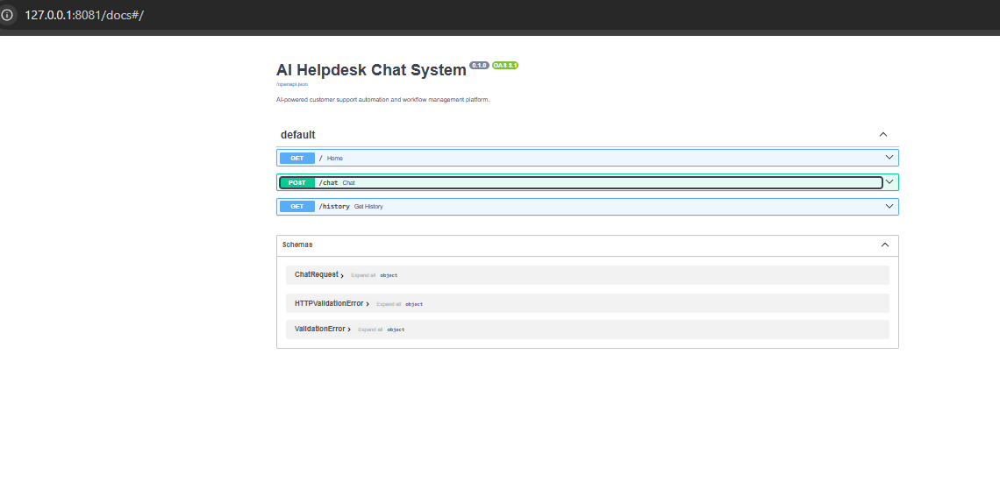

# AI Helpdesk Chat System


## Overview

AI Helpdesk Chat System is an AI-powered customer support automation platform built using FastAPI, SQLite, JavaScript, and workflow-based conversational automation logic.

The platform simulates intelligent customer support operations through categorized responses, automated workflows, escalation handling, and persistent conversation history.

## Problem Statement

Customer support operations often involve repetitive workflows such as:

- password reset requests
- refund processing
- payment issue handling
- urgent ticket escalation

Manual handling increases operational overhead and slows support response time.

## Solution

This system automates customer support workflows by:

- categorizing support requests
- assigning ticket priority
- generating automated responses
- storing conversation history
- simulating AI-powered support operations

## Key Features

- AI-style automated chat responses
- Workflow-based support logic
- Ticket categorization
- Priority handling system
- Chat history storage
- FastAPI backend
- Interactive frontend dashboard
- Swagger API documentation
- SQLite integration
- Responsive modern UI

## Technologies Used

- Python
- FastAPI
- SQLAlchemy
- SQLite
- HTML
- CSS
- JavaScript
- REST APIs
- Uvicorn

## System Workflow

1. User submits support request
2. Backend analyzes request content
3. Workflow engine categorizes request
4. Priority level assigned
5. Automated response generated
6. Conversation saved to database
7. Chat history becomes available for review

## Architecture Diagram


```text
Frontend Dashboard
        ↓
FastAPI Backend
        ↓
Workflow Logic Engine
        ↓
SQLite Database
        ↓
Conversation History
```

## API Endpoints

| Method | Endpoint | Description |
|---|---|---|
| GET | `/` | Health check |
| POST | `/chat` | Process support request |
| GET | `/history` | Load chat history |

## Example Request

```json
{
  "message": "I forgot my password"
}
```

## Example Response

```json
{
  "user_message": "I forgot my password",
  "reply": "Please use the password reset option available on the login page.",
  "category": "authentication",
  "priority": "normal",
  "status": "processed"
}
```

## Screenshots

### Dashboard


### API Documentation



### Chat History


## Demo Video

[Watch Demo Video](demo/ai-helpdesk-demo.mp4)

## Installation

Clone repository:

```bash
git clone https://github.com/NASRATULLAH786/ai-helpdesk-chat-system.git
cd ai-helpdesk-chat-system
```

Create virtual environment:

```bash
python -m venv venv
```

Activate virtual environment:

```bash
venv\Scripts\activate
```

Install dependencies:

```bash
pip install -r requirements.txt
```

Run backend:

```bash
uvicorn app.main:app --reload --port 8081
```

Open API documentation:

```text
http://127.0.0.1:8081/docs
```

Open frontend:

```text
frontend/index.html
```

## Environment Variables

Create local `.env` file:

```env
GROQ_API_KEY=
DATABASE_URL=sqlite:///./chat_history.db
MODEL_NAME=llama3-70b-8192
APP_ENV=development
```

## Technical Challenges

- Workflow response categorization
- Frontend/backend synchronization
- Chat history persistence
- Support ticket routing simulation
- UI state management
- Error handling

## Future Improvements

- Real LLM integration
- Multi-user support
- Authentication system
- Admin dashboard
- Ticket assignment workflows
- Email notifications
- OCR attachment handling
- Cloud deployment

## Project Impact

This project demonstrates practical AI automation engineering skills including:

- backend API development
- workflow automation
- support system design
- frontend/backend integration
- database-driven workflows
- conversational automation systems