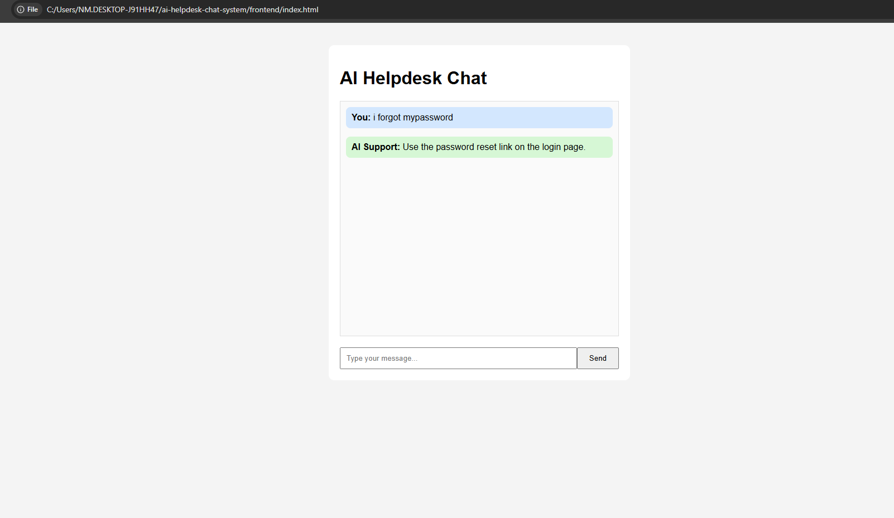

# AI Helpdesk Chat System

<<<<<<< HEAD
## Overview

The AI Helpdesk Chat System is an intelligent customer support automation platform designed to improve support workflows through AI-powered conversations, automated ticket handling, and intelligent response generation.

The system integrates Large Language Models (LLMs), backend APIs, database workflows, and automation logic to provide scalable and efficient customer support operations.
=======


## Overview
>>>>>>> 4548e55 (Finalize AI helpdesk chat system)

AI Helpdesk Chat System is an AI-powered customer support automation platform built using FastAPI, SQLite, JavaScript, and workflow-based conversational automation logic.

<<<<<<< HEAD
## Problem Statement

Many organizations struggle with repetitive support requests, delayed response times, and inefficient customer service workflows.

Manual support handling increases operational costs and reduces response efficiency. This project solves these problems using AI-powered automation and intelligent workflow orchestration.
=======
The platform simulates intelligent customer support operations through categorized responses, automated workflows, escalation handling, and persistent conversation history.

## Problem Statement

Customer support operations often involve repetitive workflows such as:
- password reset requests
- refund processing
- payment issue handling
- urgent ticket escalation

Manual handling increases operational overhead and slows support response time.

## Solution
>>>>>>> 4548e55 (Finalize AI helpdesk chat system)

This system automates customer support workflows by:
- categorizing support requests
- assigning ticket priority
- generating automated responses
- storing conversation history
- simulating AI-powered support operations

<<<<<<< HEAD
## Solution

The platform automates customer support interactions using AI-driven conversation handling, intelligent response generation, ticket categorization, and backend workflow automation.

The system improves support efficiency while reducing repetitive manual tasks.

---

## Key Features

- AI-powered customer support chatbot
- Intelligent response generation
- Automated ticket categorization
- Backend workflow automation
- REST API integration
- Database-driven support management
- Real-time interaction handling
- Modular and scalable architecture
- Error handling and validation
- JSON-based workflow processing

---

## Technologies Used

- Python
- FastAPI / Flask
- OpenAI API
- REST APIs
- PostgreSQL / MongoDB
- JSON workflows
- Webhooks
- Docker (if used)
=======
## Key Features

- AI-style automated chat responses
- Workflow-based support logic
- Ticket categorization
- Priority handling system
- Chat history storage
- FastAPI backend
- Interactive frontend dashboard
- Swagger API documentation
- SQLite integration
- Responsive modern UI

## Technologies Used

- Python
- FastAPI
- SQLAlchemy
- SQLite
- HTML
- CSS
- JavaScript
- REST APIs
- Uvicorn
>>>>>>> 4548e55 (Finalize AI helpdesk chat system)

## System Workflow

<<<<<<< HEAD
## System Workflow

1. User sends support request
2. Backend API receives the request
3. AI model processes conversation context
4. System generates intelligent response
5. Ticket information is stored in database
6. Workflow automation triggers required actions
7. Final response is returned to the user
=======
1. User submits support request
2. Backend analyzes request content
3. Workflow engine categorizes request
4. Priority level assigned
5. Automated response generated
6. Conversation saved to database
7. Chat history becomes available for review

## Architecture Diagram


```text
Frontend Dashboard
        ↓
FastAPI Backend
        ↓
Workflow Logic Engine
        ↓
SQLite Database
        ↓
Conversation History
```
>>>>>>> 4548e55 (Finalize AI helpdesk chat system)

## API Endpoints

<<<<<<< HEAD
## Architecture Diagram


Example Architecture:

User → Frontend Chat Interface → Backend API → AI Processing Engine → Database → Workflow Engine → Response System
=======
| Method | Endpoint | Description |
|---|---|---|
| GET | `/` | Health check |
| POST | `/chat` | Process support request |
| GET | `/history` | Load chat history |

## Example Request

```json
{
  "message": "I forgot my password"
}
```
>>>>>>> 4548e55 (Finalize AI helpdesk chat system)

## Example Response

<<<<<<< HEAD
## API Integrations

- OpenAI API
- REST API services
- Webhook integrations
- Backend database systems
=======
```json
{
  "user_message": "I forgot my password",
  "reply": "Please use the password reset option available on the login page.",
  "category": "authentication",
  "priority": "normal",
  "status": "processed"
}
```

## Screenshots
>>>>>>> 4548e55 (Finalize AI helpdesk chat system)

### Dashboard

<<<<<<< HEAD
## Technical Challenges

- Maintaining AI conversation context
- Handling asynchronous workflows
- Managing API rate limits
- Optimizing response quality
- Implementing reliable error handling
- Designing scalable workflow architecture

---

## Future Improvements

- Multi-agent AI workflows
- Voice-based support integration
- Analytics dashboard
- Vector database integration
- Role-based access control
- Sentiment analysis support

---

## Screenshots

### Chat Interface


### Workflow Execution


### API Logs


---

## Demo Video

[Watch Demo](YOUR_DEMO_LINK)

---

## Installation
=======


### API Documentation


### Chat History


## Demo Video

[Watch Demo Video](demo/ai-helpdesk-demo.mp4)

## Installation

Clone repository:

```bash
git clone https://github.com/NASRATULLAH786/ai-helpdesk-chat-system.git
cd ai-helpdesk-chat-system
```

Create virtual environment:

```bash
python -m venv venv
```

Activate virtual environment:

```bash
venv\Scripts\activate
```

Install dependencies:
>>>>>>> 4548e55 (Finalize AI helpdesk chat system)

```bash
git clone 
cd ai-helpdesk-chat-system
pip install -r requirements.txt
<<<<<<< HEAD
python app.py
=======
```

Run backend:

```bash
uvicorn app.main:app --reload --port 8081
```

Open API documentation:

```text
http://127.0.0.1:8081/docs
```

Open frontend:

```text
frontend/index.html
```

## Environment Variables

Create local `.env` file:

```env
GROQ_API_KEY=
DATABASE_URL=sqlite:///./chat_history.db
MODEL_NAME=llama3-70b-8192
APP_ENV=development
```

## Technical Challenges

- Workflow response categorization
- Frontend/backend synchronization
- Chat history persistence
- Support ticket routing simulation
- UI state management
- Error handling

## Future Improvements

- Real LLM integration
- Multi-user support
- Authentication system
- Admin dashboard
- Ticket assignment workflows
- Email notifications
- OCR attachment handling
- Cloud deployment

## Project Impact

This project demonstrates practical AI automation engineering skills including:
- backend API development
- workflow automation
- support system design
- frontend/backend integration
- database-driven workflows
- conversational automation systems
>>>>>>> 4548e55 (Finalize AI helpdesk chat system)
