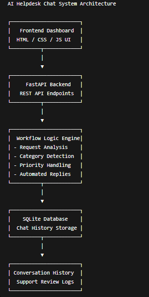

# AI Helpdesk Chat System

## Overview

The AI Helpdesk Chat System is an intelligent customer support automation platform designed to improve support workflows through AI-powered conversations, automated ticket handling, and intelligent response generation.

The system integrates Large Language Models (LLMs), backend APIs, database workflows, and automation logic to provide scalable and efficient customer support operations.

---

## Problem Statement

Many organizations struggle with repetitive support requests, delayed response times, and inefficient customer service workflows.

Manual support handling increases operational costs and reduces response efficiency. This project solves these problems using AI-powered automation and intelligent workflow orchestration.

---

## Solution

The platform automates customer support interactions using AI-driven conversation handling, intelligent response generation, ticket categorization, and backend workflow automation.

The system improves support efficiency while reducing repetitive manual tasks.

---

## Key Features

- AI-powered customer support chatbot
- Intelligent response generation
- Automated ticket categorization
- Backend workflow automation
- REST API integration
- Database-driven support management
- Real-time interaction handling
- Modular and scalable architecture
- Error handling and validation
- JSON-based workflow processing

---

## Technologies Used

- Python
- FastAPI / Flask
- OpenAI API
- REST APIs
- PostgreSQL / MongoDB
- JSON workflows
- Webhooks
- Docker (if used)

---

## System Workflow

1. User sends support request
2. Backend API receives the request
3. AI model processes conversation context
4. System generates intelligent response
5. Ticket information is stored in database
6. Workflow automation triggers required actions
7. Final response is returned to the user

---

## Architecture Diagram



Example Architecture:

User → Frontend Chat Interface → Backend API → AI Processing Engine → Database → Workflow Engine → Response System

---

## API Integrations

- OpenAI API
- REST API services
- Webhook integrations
- Backend database systems

---

## Technical Challenges

- Maintaining AI conversation context
- Handling asynchronous workflows
- Managing API rate limits
- Optimizing response quality
- Implementing reliable error handling
- Designing scalable workflow architecture

---

## Future Improvements

- Multi-agent AI workflows
- Voice-based support integration
- Analytics dashboard
- Vector database integration
- Role-based access control
- Sentiment analysis support

---

## Screenshots

### Chat Interface


### Workflow Execution


### API Logs


---

## Demo Video

[Watch Demo](YOUR_DEMO_LINK)

---

## Installation

```bash
git clone 
cd ai-helpdesk-chat-system
pip install -r requirements.txt
python app.py
